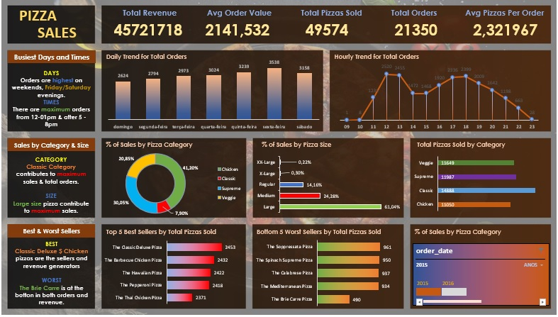

# Portfólio de Data Analyst 

Dashboards com ênfase em práticas utilizando o SQL e Excel, com o objetivo de desenvolver um portfólio que represente situações reais do cotidiano.

- [x] ANÁLISE DAS VENDAS DE UMA PIZARRIA: DASHBOARD
   -- Um case de estudos onde usei um tutorial do Youtube no qual é ensinado o passo-a-passo da analise anual de vendas em uma pizarria
      As analises feitas são: 
           - Total de faturamento 
           - Média de preço por pedido 
           - Total de pizzas vendidas 
           - Total de pedidos 
           - Média de pizzas por pedido 
           - Total de vendas por dia 
           - Horario das vendas 
           - Porcentagem de vendas por categoria de pizzas 
           - Porcentagem de vendas por tamanho de pizzas 
           - Total de pizzas vendidas por categoria 
           - Ranking da 5 melhores e piores sabores de pizza 
 
   

   -- Arquivos utilizados nessa analise: [Dashboard de Analise dinâmica de vendas](https://github.com/ThiagoAoki88/Data-Analyst-Projects/tree/main/Pizza%20Sales) 
    *Video base para o estudo [link](https://www.youtube.com/watch?v=3Acmk-rqn6c&t=1238s) 
    *Video base para o estudo [link](https://www.youtube.com/watch?v=wGJYJ42V8OQ&t=33s) 
